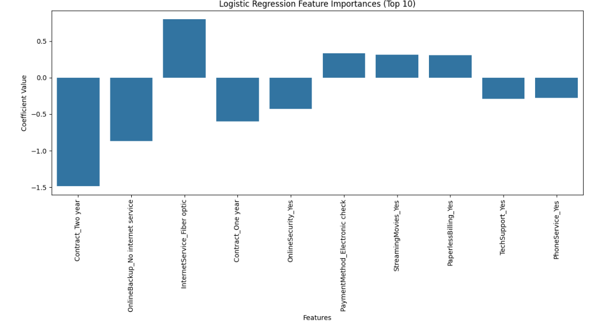
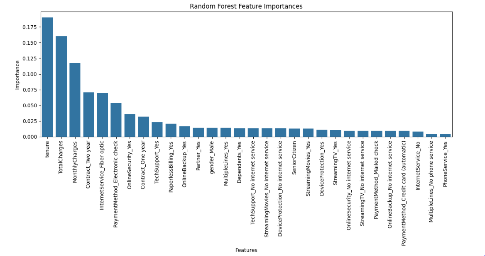
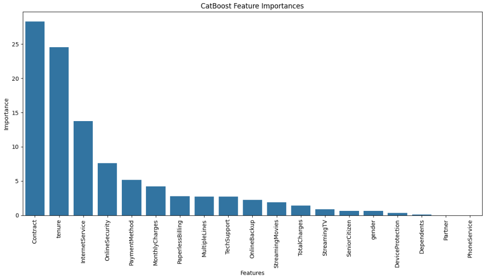
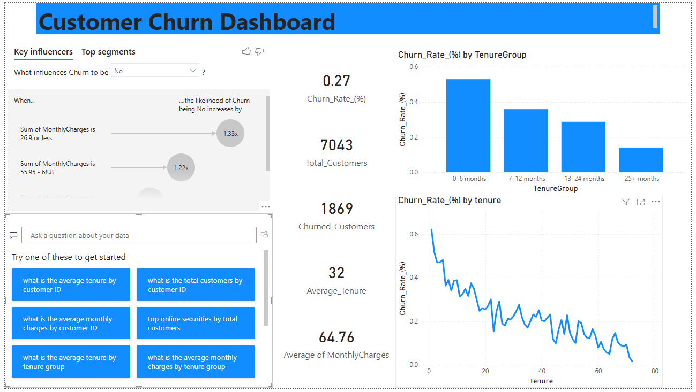

# 📊 Customer Churn Analysis & Prediction

**Internship Task 2 – Future Interns**
Repository: FUTURE_DS_02

## 🧠 Project Overview

Customer retention is a critical driver of growth for subscription-based businesses. In this project, I analyzed customer churn behavior using a real-world telecom dataset and built machine learning models to predict which customers are most likely to leave.

The project combines:

- **Exploratory and retention analysis**
- **Business-focused dashboards (Power BI)**
- **Predictive machine learning models**
- **Actionable insights for decision-makers**

The work simulates what a data analyst / data scientist would deliver to a product, growth, or retention team in a SaaS or subscription-based company

## 🎯 Business Questions Addressed

This project aims to answer the following key questions:

- Why are customers leaving the platform?
- Which customer segments are most likely to churn?
- What factors most strongly influence churn?
- How accurately can we predict churn using machine learning?
- What actions can the business take to improve customer retention?

## 📁 Dataset Description

Dataset: Telco Customer Churn (IBM Sample Dataset)
Each row represents a customer, and each column represents customer attributes.

The dataset includes:

- **Customer demographics**: gender, senior citizen, partner, dependents
- **Service information**: phone service, internet service, online security, streaming, tech support
- **Account details**: tenure, contract type, payment method, monthly and total charges
- **Target variable**: Churn (Yes / No)

Source: IBM Sample Data Sets

## 🛠️ Tools & Technologies Used

_ Python (Google Colab)
  - pandas, numpy
  - scikit-learn
  - CatBoost
  - SHAP (for model explainability)
- Power BI
  - Interactive retention & churn dashboard
- GitHub
  - Version control & project documentation

## 🔄 Project Workflow

1. Data Cleaning & Preparation
  - Removed duplicates
  - Handled missing values
  - Encoded categorical variables
  - Excluded non-informative columns (e.g., customerID)

2. Exploratory & Retention Analysis
  - Churn distribution
  - Tenure and contract-based churn trends
  - Service-level churn patterns
  - Customer segmentation

3. Dashboard Development (Power BI)
  - Churn overview KPIs
  - Customer segmentation views
  - Retention drivers and patterns
  - Business-focused storytelling

4. Machine Learning Modeling
  - Logistic Regression (baseline & interpretable)
  - Random Forest Classifier
  - CatBoost Classifier (boosting model)

5. Model Evaluation & Explainability
  - Accuracy, Precision, Recall, F1-score
  - ROC-AUC (primary metric)
  - Feature importance & SHAP analysis

## 🤖 Machine Learning Models & Results
Model Comparison Summary

Model	Accuracy	ROC-AUC
Logistic Regression	81.26%	0.8590
Random Forest	80.36%	0.8561
CatBoost	80.41%	0.8602

| Model | Accuracy (Cross-Val) | ROC-AUC |
|----------|----------|----------|
| Logistic Regression    | 81.26%   | 0.8590  |
| Random Forest    | 	80.36%  | 0.8561 |
| CatBoost    | 80.41%  | 0.8602   |

ROC-AUC was prioritized due to class imbalance and the importance of correctly identifying churners.

## 🔹 Logistic Regression (Baseline Model)

- **Best hyperparameters**:
  - C = 1
  - Penalty = L1
- **Test Performance**:
  - Accuracy: 81.26%
  - ROC-AUC: 0.8590
- **Key Insights (Coefficients)**:
  - Two-year contracts strongly reduce churn risk
  - Fiber optic internet increases churn likelihood
  - Security-related services reduce churn

This model provides clear interpretability and aligns well with business intuition.

## 🔹 Random Forest Classifier

- **Best hyperparameters**:
  - n_estimators = 200
  - max_depth = 10
  - min_samples_split = 5
  - min_samples_leaf = 2
- **Test Performance**:
  - Accuracy: 80.36%
  - ROC-AUC: 0.8561
- **Top Features**:
  - Tenure
  - TotalCharges
  - MonthlyCharges
  - Contract type
  - Internet service type

The model captured **non-linear relationships** and reinforced findings from exploratory analysis.

## 🔹 CatBoost Classifier (Best Overall Model)

- **Best hyperparameters**:
  - depth = 4
  - iterations = 100
  - learning_rate = 0.1
  - l2_leaf_reg = 3
- **Test Performance**:
  - Accuracy: 80.41%
  - ROC-AUC: 0.8602
- **Top Feature Importances**:
  - Contract (28.30%)
  - Tenure (24.57%)
  - InternetService (13.76%)
  - OnlineSecurity
  - PaymentMethod

CatBoost performed best overall and handled categorical features efficiently.

## 🔍 Model Explainability

Feature importance and SHAP analysis revealed consistent churn drivers across models:

- Customers with **short tenure** are more likely to churn
- **Month-to-month contracts** significantly increase churn risk
- **Fiber optic internet users** show higher churn
- Security and support services reduce churn probability

These insights translate directly into **retention strategies**.

## 📊 Power BI Dashboard

The Power BI dashboard presents:
- Overall churn rate and customer counts
- Churn by contract type, tenure group, and service usage
- High-risk customer segments
- Clear visuals designed for business stakeholders

## 💡 Business Recommendations

Based on the analysis and modeling results:
- Incentivize customers to move from month-to-month to long-term contracts
- Target early-tenure customers with onboarding and engagement programs
- Improve experience and pricing transparency for fiber optic internet users
- Bundle security and support services to reduce churn risk
- Use the CatBoost model to proactively identify at-risk customers

## 🚀 Next Steps & Improvements
- Address class imbalance using techniques such as SMOTE or class weighting
- Perform probability threshold tuning to improve churn recall
- Deploy the model as a churn-risk scoring tool
- Integrate predictions into dashboards for real-time decision-making

## 📢 Project Showcase

This project was completed as part of **Future Interns – Data Science Internship Task 2**.

The work is suitable for presentation to:
- Product Managers
- Growth & Retention Teams
- Startup Founders
- Business Stakeholders
